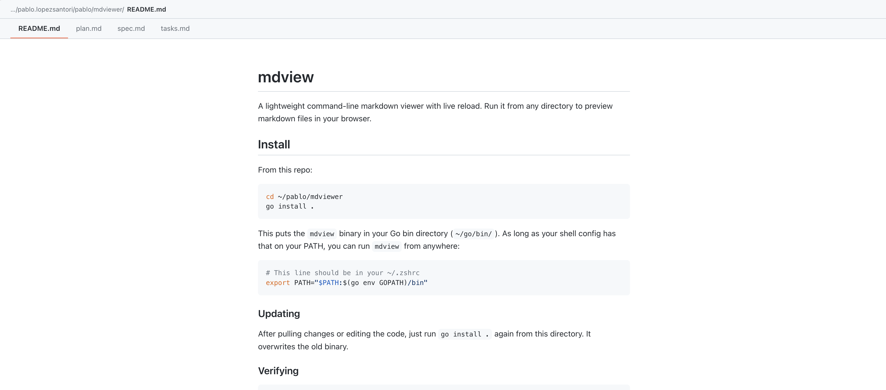

# mdview

A lightweight command-line markdown viewer with live reload. Run it from any directory to preview markdown files in your browser.



## Install

From this repo:

```
cd ~/pablo/mdviewer
go install .
```

This puts the `mdview` binary in your Go bin directory (`~/go/bin/`). As long as your shell config has that on your PATH, you can run `mdview` from anywhere:

```sh
# This line should be in your ~/.zshrc
export PATH="$PATH:$(go env GOPATH)/bin"
```

### Updating

After pulling changes or editing the code, just run `go install .` again from this directory. It overwrites the old binary.

### Verifying

```
which mdview    # should print ~/go/bin/mdview
```

## Usage

```
mdview                     # serve current directory
mdview README.md           # serve a single file
mdview docs/               # serve a directory
mdview --port 8080 .       # custom port
mdview --no-open .         # don't auto-open browser
```

The browser opens automatically. Edit any markdown file and the page reloads instantly. Press `Ctrl+C` to stop.

### Flags

| Flag | Default | Description |
|------|---------|-------------|
| `--port` | `1414` | Port to serve on. If taken, increments until one is free. |
| `--host` | `127.0.0.1` | Host to bind to |
| `--no-open` | `false` | Don't open browser automatically |

## Features

- GitHub-Flavored Markdown (tables, task lists, strikethrough, autolinks)
- Syntax highlighting for code blocks
- Live reload on file changes
- File navigation when multiple markdown files exist
- Relative images and links resolved correctly
- Single binary, no runtime dependencies
